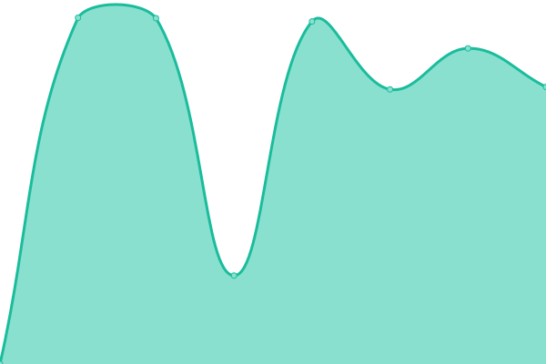

# [📈 Live Status](https://interTwin-eu.github.io/uptime): <!--live status--> **🟧 Partial outage**

This repository contains the open-source uptime monitor and status page for [interTwin Community](https://www.intertwin.eu/), powered by [Upptime](https://github.com/upptime/upptime).

With [Upptime](https://upptime.js.org), you can get your own unlimited and free uptime monitor and status page, powered entirely by a GitHub repository. We use [Issues](https://github.com/interTwin-eu/uptime/issues) as incident reports, [Actions](https://github.com/interTwin-eu/uptime/actions) as uptime monitors, and [Pages](https://interTwin-eu.github.io/uptime) for the status page.

<!--start: status pages-->
<!-- This summary is generated by Upptime (https://github.com/upptime/upptime) -->
<!-- Do not edit this manually, your changes will be overwritten -->
<!-- prettier-ignore -->
| URL | Status | History | Response Time | Uptime |
| --- | ------ | ------- | ------------- | ------ |
|  [Rucio](rucio-intertwin-testbed.desy.de) | 🟩 Up | [rucio.yml](https://github.com/interTwin-eu/uptime/commits/HEAD/history/rucio.yml) | 

 144ms
     
 | 

<a href="https://interTwin-eu.github.io/uptime/history/rucio">100.00%</a>
    

|  [FTS](fts-egi.cern.ch) | 🟩 Up | [fts.yml](https://github.com/interTwin-eu/uptime/commits/HEAD/history/fts.yml) | 

 142ms
     
 | 

<a href="https://interTwin-eu.github.io/uptime/history/fts">100.00%</a>
    

|  [PaaS Orchestrator](https://eosc-paas.cloud.ba.infn.it) | 🟩 Up | [paa-s-orchestrator.yml](https://github.com/interTwin-eu/uptime/commits/HEAD/history/paa-s-orchestrator.yml) | 

 4600ms
     
 | 

<a href="https://interTwin-eu.github.io/uptime/history/paa-s-orchestrator">100.00%</a>
    

|  [JupyterHub_interlink](https://jupyter-dev-ukri.intertwin.fedcloud.eu/) | 🟩 Up | [jupyter-hub-interlink.yml](https://github.com/interTwin-eu/uptime/commits/HEAD/history/jupyter-hub-interlink.yml) | 

 1359ms
     
 | 

<a href="https://interTwin-eu.github.io/uptime/history/jupyter-hub-interlink">79.22%</a>
    

|  [EGI Check-in Demo](https://aai-demo.egi.eu/) | 🟩 Up | [egi-check-in-demo.yml](https://github.com/interTwin-eu/uptime/commits/HEAD/history/egi-check-in-demo.yml) | 

 2239ms
     
 | 

<a href="https://interTwin-eu.github.io/uptime/history/egi-check-in-demo">100.00%</a>
    

|  [GRNET Cloud](https://ui.cloud.grnet.gr/) | 🟩 Up | [grnet-cloud.yml](https://github.com/interTwin-eu/uptime/commits/HEAD/history/grnet-cloud.yml) | 

 1320ms
     
 | 

<a href="https://interTwin-eu.github.io/uptime/history/grnet-cloud">99.46%</a>
    

|  [UKRI Cloud](https://openstack.stfc.ac.uk) | 🟩 Up | [ukri-cloud.yml](https://github.com/interTwin-eu/uptime/commits/HEAD/history/ukri-cloud.yml) | 

 2039ms
     
 | 

<a href="https://interTwin-eu.github.io/uptime/history/ukri-cloud">85.66%</a>
    

|  [OSCAR-GRNET](https://oscar-grnet.intertwin.fedcloud.eu/) | 🟩 Up | [oscar-grnet.yml](https://github.com/interTwin-eu/uptime/commits/HEAD/history/oscar-grnet.yml) | 

 959ms
     
 | 

<a href="https://interTwin-eu.github.io/uptime/history/oscar-grnet">100.00%</a>
    

|  [OSCAR-UKRI](https://oscar-ukri.intertwin.fedcloud.eu/) | 🟩 Up | [oscar-ukri.yml](https://github.com/interTwin-eu/uptime/commits/HEAD/history/oscar-ukri.yml) | 

 969ms
     
 | 

<a href="https://interTwin-eu.github.io/uptime/history/oscar-ukri">80.64%</a>
    

|  [MLFlow](https://mlflow.intertwin.fedcloud.eu/signup) | 🟩 Up | [ml-flow.yml](https://github.com/interTwin-eu/uptime/commits/HEAD/history/ml-flow.yml) | 

 803ms
     
 | 

<a href="https://interTwin-eu.github.io/uptime/history/ml-flow">100.00%</a>
    

|  [SQAasS](https://sqaaas.eosc-synergy.eu/) | 🟩 Up | [sq-aas-s.yml](https://github.com/interTwin-eu/uptime/commits/HEAD/history/sq-aas-s.yml) | 

 314ms
     
 | 

<a href="https://interTwin-eu.github.io/uptime/history/sq-aas-s">100.00%</a>
    

|  [ALISE](https://alise.data.kit.edu/) | 🟩 Up | [alise.yml](https://github.com/interTwin-eu/uptime/commits/HEAD/history/alise.yml) | 

 763ms
     
 | 

<a href="https://interTwin-eu.github.io/uptime/history/alise">100.00%</a>
    

|  [Container Registry](https://registry.egi.eu/) | 🟩 Up | [container-registry.yml](https://github.com/interTwin-eu/uptime/commits/HEAD/history/container-registry.yml) | 

 1215ms
     
 | 

<a href="https://interTwin-eu.github.io/uptime/history/container-registry">100.00%</a>
    

|  [dCache VEGA](dcache.sling.si) | 🟩 Up | [d-cache-vega.yml](https://github.com/interTwin-eu/uptime/commits/HEAD/history/d-cache-vega.yml) | 

 141ms
     
 | 

<a href="https://interTwin-eu.github.io/uptime/history/d-cache-vega">100.00%</a>
    

|  [interLink VEGA](intertwin.vega.izum.si) | 🟩 Up | [inter-link-vega.yml](https://github.com/interTwin-eu/uptime/commits/HEAD/history/inter-link-vega.yml) | 

 149ms
     
 | 

<a href="https://interTwin-eu.github.io/uptime/history/inter-link-vega">100.00%</a>
    

|  [test](test.notification) | 🟥 Down | [test.yml](https://github.com/interTwin-eu/uptime/commits/HEAD/history/test.yml) | 

 0ms
     
 | 

<a href="https://interTwin-eu.github.io/uptime/history/test">100.00%</a>
    

<!--end: status pages-->

[**Visit our status website →**](https://interTwin-eu.github.io/uptime)

## 📄 License

- Powered by: [Upptime](https://github.com/upptime/upptime)
- Code: [MIT](./LICENSE) © [Anand Chowdhary](https://anandchowdhary.com), supported by [Pabio](https://pabio.com)
- Data in the `./history` directory: [Open Database License](https://opendatacommons.org/licenses/odbl/1-0/)
